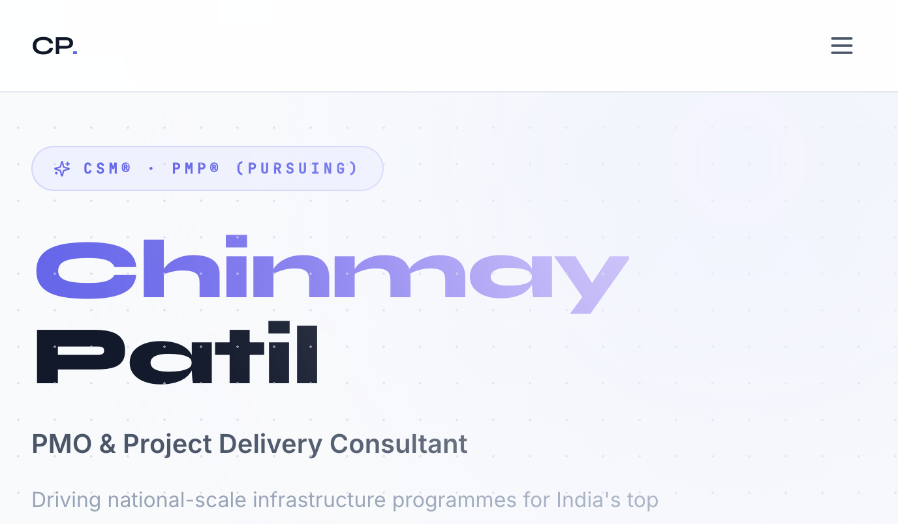
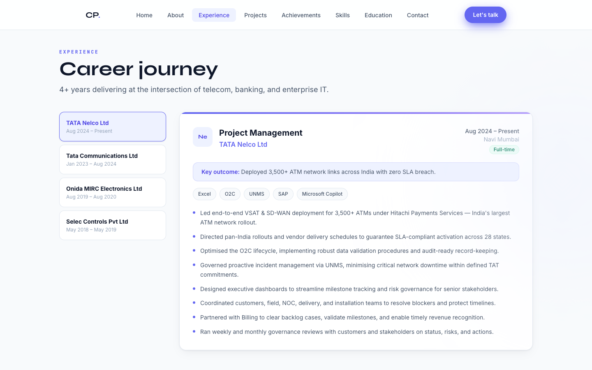
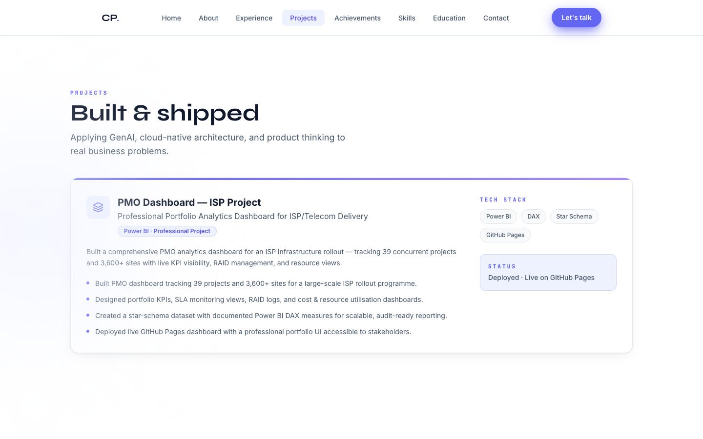
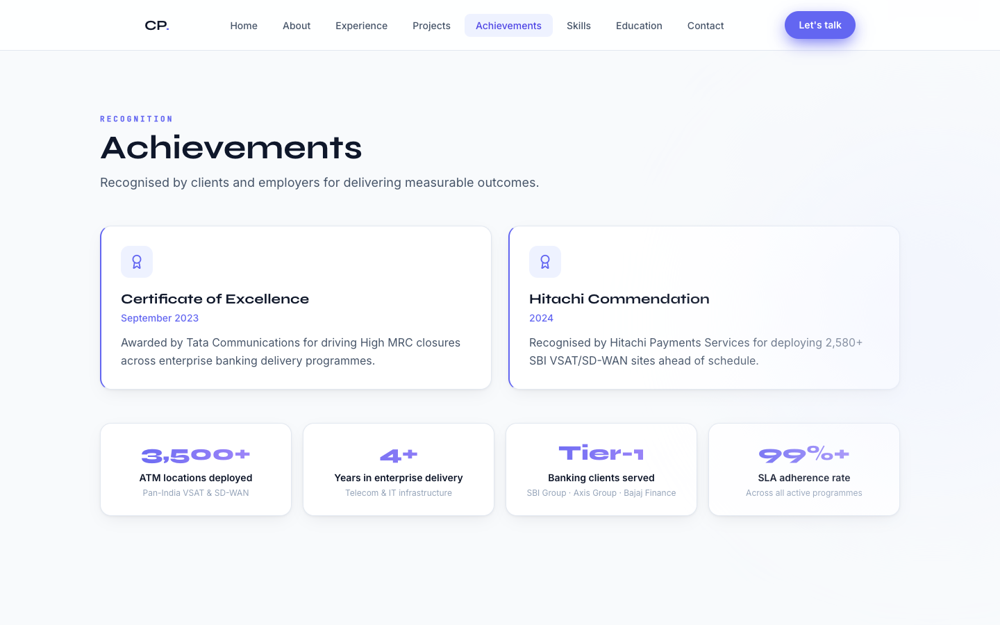

<div align="center">

# Chinmay Patil — Portfolio

### PMO & Project Delivery Consultant

[](https://www.linkedin.com/in/chinmaypatil04)
[](mailto:chinmaypatil13@gmail.com)
[](https://www.linkedin.com/in/chinmaypatil04)
[](https://www.linkedin.com/in/chinmaypatil04)
[](https://vitejs.dev)

**Driving national-scale infrastructure programmes for India's top banking institutions —  
with precision, governance, and measurable outcomes.**

</div>

---

## Preview



<table>
  <tr>
    <td></td>
    <td></td>
  </tr>
  <tr>
    <td align="center"><em>Experience — tabbed, interactive</em></td>
    <td align="center"><em>Projects — PMO Dashboard</em></td>
  </tr>
  <tr>
    <td></td>
    <td valign="top" style="padding: 16px;">
      <strong>8 dedicated pages, each with its own URL:</strong><br/><br/>
      🏠 Home &nbsp;·&nbsp; 👤 About<br/>
      💼 Experience &nbsp;·&nbsp; 🚀 Projects<br/>
      🏆 Achievements &nbsp;·&nbsp; 🛠 Skills<br/>
      🎓 Education &nbsp;·&nbsp; 📬 Contact
    </td>
  </tr>
</table>

---

## About Chinmay

**Chinmay Patil** is a PMO-oriented project delivery professional with **4+ years** of experience managing high-stakes telecom and IT infrastructure programmes for India's leading financial institutions.

### Key highlights

| Metric | Detail |
|---|---|
| **3,500+** | ATM locations deployed pan-India (VSAT & SD-WAN) |
| **39** | Concurrent projects tracked in Power BI PMO dashboard |
| **3,600+** | Sites monitored across ISP rollout programme |
| **Tier-1** | Banking clients — SBI, Axis Bank, Bajaj Finance |

### Awards & Recognition

- 🏅 **Certificate of Excellence** — Tata Communications (Sept 2023) for driving High MRC closures
- 🏅 **Hitachi Commendation** — for deploying 2,580+ SBI VSAT/SD-WAN sites ahead of schedule

---

## Experience

| Role | Company | Period |
|---|---|---|
| Project Management | TATA Nelco Ltd | Aug 2024 – Present |
| Project Coordinator | Tata Communications Ltd | Jan 2023 – Aug 2024 |
| Operations Intern | Onida MIRC Electronics Ltd | Aug 2019 – Aug 2020 |
| Automation Supervisor | Selec Controls Pvt Ltd | May 2018 – May 2019 |

---

## Skills

**PMO & Delivery** — RAID Matrix · Agile/Scrum · Waterfall · Hybrid PM · ITIL · Vendor & SLA Management  
**Data & Reporting** — Power BI · DAX · Star Schema · MS Excel · KPI Dashboards  
**GenAI & Automation** — Microsoft Copilot · n8n · AI Agents & RAG · Prompt Engineering · Python  
**Tools** — JIRA · ServiceNow · Confluence · MS Project · SAP · UNMS · Optimus · M6  
**Telecom** — SD-WAN · VSAT · MPLS · ILL · O2C Lifecycle · NOC Operations  

---

## Education & Certifications

- 🎓 **B.E. Electronics & Telecommunications** — Mumbai University (2019–2022) · CGPA: 8.4
- ✅ **Certified ScrumMaster® (CSM)** — Scrum Alliance / Simplilearn
- ✅ **PMP®** — Certified (PMI / Simplilearn)
- ✅ **GenAI in Project & Quality Management** — Simplilearn
- ✅ **Networking & Administration Fundamentals** — LinkedIn Learning

---

## Tech Stack (this portfolio)

| Layer | Technology |
|---|---|
| Framework | React 18 + TypeScript |
| Build tool | Vite |
| Styling | Tailwind CSS |
| Routing | React Router v6 |
| Animations | Framer Motion |
| Icons | Lucide React |

---

## Run locally

```bash
git clone https://github.com/Chinmay-Patil04/Prortfolio_Chinmay.git
cd Prortfolio_Chinmay
npm install
npm run dev
```

Open [http://localhost:5173](http://localhost:5173)

## Build for production

```bash
npm run build
```

Output goes to `dist/` — deploy to Vercel, Netlify, or GitHub Pages.

## Update content

All content lives in **`src/data/profile.ts`** — edit name, experience, skills, projects, and certifications there without touching any component.

---

## Connect

| | |
|---|---|
| **Email** | [chinmaypatil13@gmail.com](mailto:chinmaypatil13@gmail.com) |
| **Phone** | +91 70575 38253 |
| **LinkedIn** | [linkedin.com/in/chinmaypatil04](https://www.linkedin.com/in/chinmaypatil04) |
| **Location** | Thane, Maharashtra, India · Open to Relocation |

---

<div align="center">
  <sub>Last updated June 2026 · Built by Chinmay Patil</sub>
</div>
